<p align="center">
  
</p>

<h1 align="center">TudouClaw 🥔🐾</h1>

<p align="center">
  <strong>开源多智能体协作平台 — 让 AI Agent 像团队一样工作</strong>
</p>

<p align="center">
  <em>An open-source multi-agent collaboration platform — make AI agents work like a team.</em>
</p>

<p align="center">
  <a href="#快速开始"></a>
  <a href="#架构概览"></a>
  <a href="https://github.com/pangalano1983-dev/TudouClaws/wiki"></a>
  <a href="#license"></a>
</p>

<p align="center">
  <a href="./README_EN.md">English</a> · <a href="./README.md">中文</a>
</p>

---

## 什么是 TudouClaw？

TudouClaw 是一个**多智能体协作平台**，你可以在其中创建、编排和管理多个 AI Agent，让它们像一个真正的软件团队一样协作完成复杂任务。

每个 Agent 拥有独立的角色（CEO、CTO、Coder、Tester、Designer……）、独立的记忆、独立的工具集和独立的成长路径。它们通过 Hub 中枢协调，可以相互委派任务、共享知识、执行工作流，并在实践中持续自我提升。

<p align="center">
  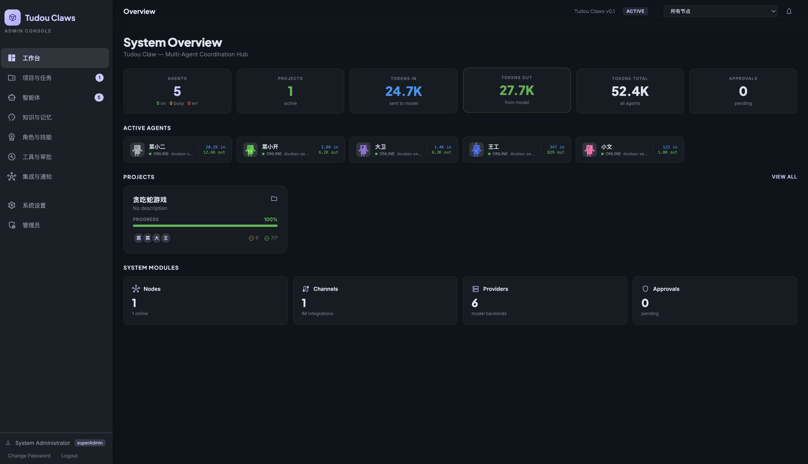
  <br/>
  <em>TudouClaw Portal — 多智能体协作控制台</em>
</p>

### 核心理念

- **多角色协作**：不只是一个 Agent，而是一个团队。CEO 拆解需求，Architect 设计方案，Coder 编写代码，Reviewer 审查质量，Tester 验证功能。
- **经验驱动成长**：Agent 从每次任务中学习，积累经验库，自动提炼可复用的技能包。
- **开放工具生态**：基于 MCP（Model Context Protocol）的工具扩展体系，内置文件、数据库、邮件、向量检索等能力，支持自定义扩展。
- **全渠道集成**：Telegram、Slack、Discord、钉钉、飞书、企业微信 — Agent 可以直接在你常用的 IM 平台上提供服务。
- **分布式部署**：Hub/Node 架构，支持单机运行，也支持跨机器分布式部署。

---

## 亮点功能

### 🤖 多角色 Agent 团队

内置 12 种专业角色，每个角色拥有独立的灵魂提示词（Soul Prompt）、主动思考规则（Active Thinking）、专属机器人形象和对应的成长路径。

<p align="center">
  
  <br/>
  <em>12 种专业角色 — 每个角色都有独特的人设和能力</em>
</p>

| 角色 | 定位 | 核心能力 |
|------|------|----------|
| CEO | 战略决策 | 需求分析、任务拆解、全局协调 |
| CTO | 技术决策 | 架构评审、技术选型、风险评估 |
| Architect | 系统架构 | 方案设计、模块划分、接口定义 |
| Coder | 编码开发 | 代码编写、调试、重构 |
| Reviewer | 代码审查 | 质量检查、安全审计、最佳实践 |
| Tester | 测试验证 | 测试用例、自动化测试、回归验证 |
| PM | 产品管理 | 需求管理、优先级排序、进度跟踪 |
| Designer | UI/UX | 界面设计、交互方案、设计规范 |
| DevOps | 运维部署 | CI/CD、容器化、监控告警 |
| Researcher | 调研分析 | 技术调研、竞品分析、方案评估 |
| Data | 数据分析 | 数据处理、可视化、洞察挖掘 |
| General | 通用助手 | 灵活响应各类任务 |

**Active Thinking（主动思考）：** 每个角色配备专属的主动思考规则，Agent 在执行任务前会先"思考"——分析上下文、评估风险、规划方案——再行动，而非盲目执行。

### 📋 项目管理与工作流

内置完整的项目管理体系和 DAG 工作流引擎，支持从需求到交付的全流程管理。

<p align="center">
  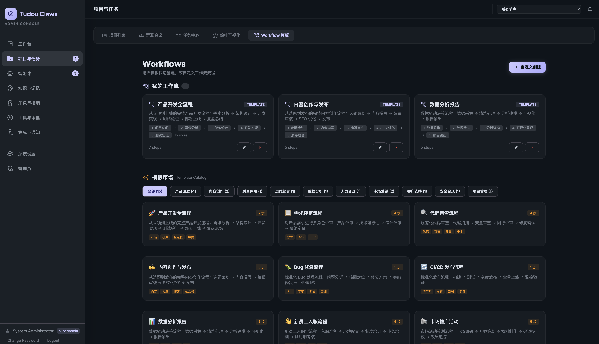
  <br/>
  <em>DAG 工作流引擎 — 自动编排多步骤任务</em>
</p>

- **15+ 预定义工作流模板**：包含软件开发全生命周期（需求分析 → 架构设计 → 编码 → 代码审查 → 测试 → 部署）
- **DAG 依赖调度**：自动识别步骤依赖关系，支持并行/串行混合执行
- **累积上下文传递**：每个步骤可获取所有前序步骤的输出
- **项目看板**：任务、里程碑、交付件、Issue 全景管理
- **会议功能**：Agent 之间可以召开"会议"（Meetings），多方协商讨论复杂决策

### 🧠 三层记忆与经验自成长

Agent 不只是执行指令——它们会学习和成长。

<p align="center">
  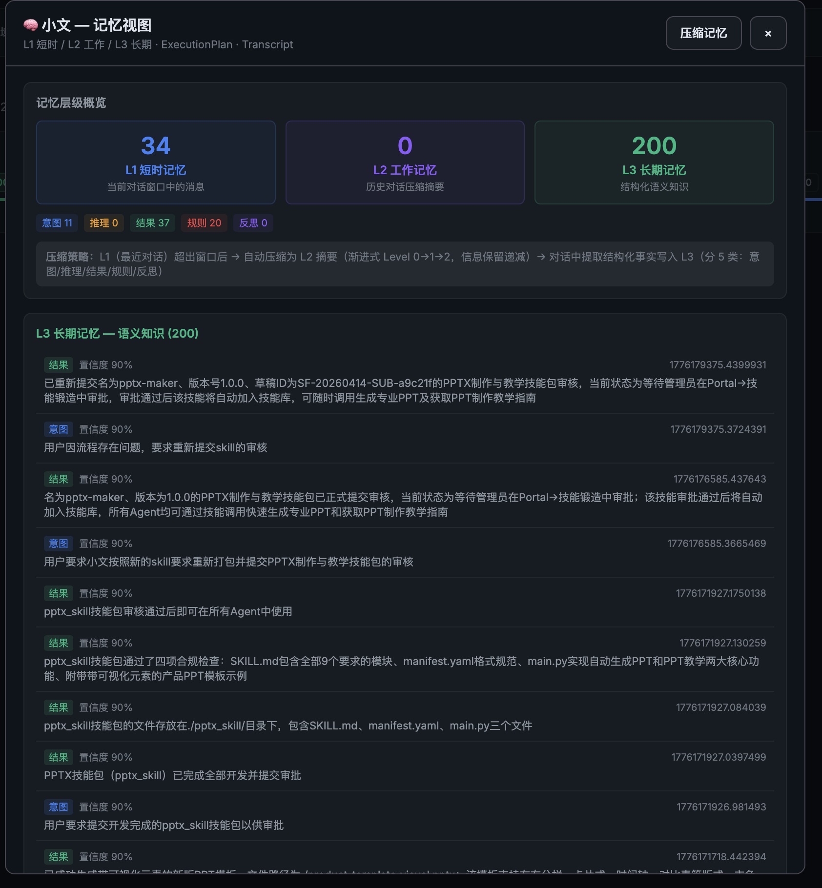
  <br/>
  <em>经验库 — Agent 从实践中学习，自动积累知识</em>
</p>

- **三层记忆架构**：L1 工作记忆（当前对话）→ L2 情景记忆（近期经验）→ L3 语义记忆（长期知识）
- **双环学习**：回顾式学习（Retrospective）+ 主动学习（Active Learning）
- **经验模板**：每条经验包含场景、核心知识、行动规则和禁忌规则
- **自动淘汰**：低成功率经验自动降权或清除
- **Knowledge Base**：支持上传文档、笔记等知识资料，Agent 在对话中自动检索引用

### 🎯 意图理解 — IntentResolver

在调用 LLM 之前，快速理解用户真实意图。

- **双层分类**：规则快速通道（203+ 中英文关键词、30+ 正则模式）+ LLM 慢通道回退
- **9 大意图类别**：代码任务、查询、部署、通信、文件操作、工作流、任务管理、学习、配置
- **智能槽位提取**：自动识别每个意图所需的参数，检测缺失信息
- **工作流自动匹配**：根据意图直接映射到对应的工作流模板

### 🔧 技能系统 — SkillForge + SkillStore + SkillScout

完整的技能生命周期管理：从自动发现、人工审核到安装使用。

<p align="center">
  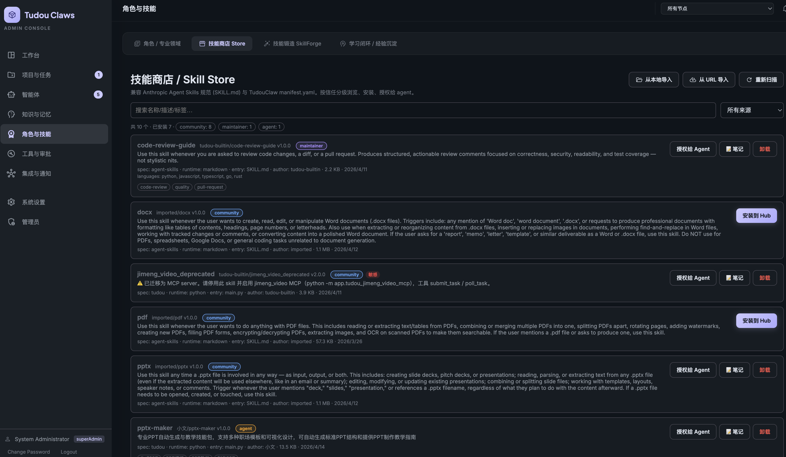
  <br/>
  <em>技能商店 — 管理、安装和分享技能包</em>
</p>

**SkillForge（技能锻造）：** Agent 自动从经验中发现重复模式，生成可复用的技能包。
- 基于 Jaccard 相似度聚合同类经验，≥3 条相似经验 + ≥75% 成功率方可成为候选
- LLM 综合多条经验生成 `manifest.yaml` + `SKILL.md` + 代码文件
- 输出待审核草案，管理员审核通过后自动导出为技能包

**SkillStore（技能商店）：** 统一管理所有技能包的安装、授权和分发。
- **五级来源分类**：`official`（官方）→ `maintainer`（维护者）→ `community`（社区）→ `agent`（Agent 创建）→ `local`（本地）
- Agent 提交的技能经审核后自动进入商店，来源标记为 `agent`
- 支持按名称搜索、按来源/运行时筛选、一键安装到 Hub
- 防重复提交：同名同版本技能不可重复提交

**SkillScout（技能发现）：** 从 GitHub 等在线源搜索和评估第三方技能包。
- 多源搜索、安全评估（运行时风险评分）、兼容性检查
- 仅推荐不安装——生成安装指南和评估报告，由用户决定

<p align="center">
  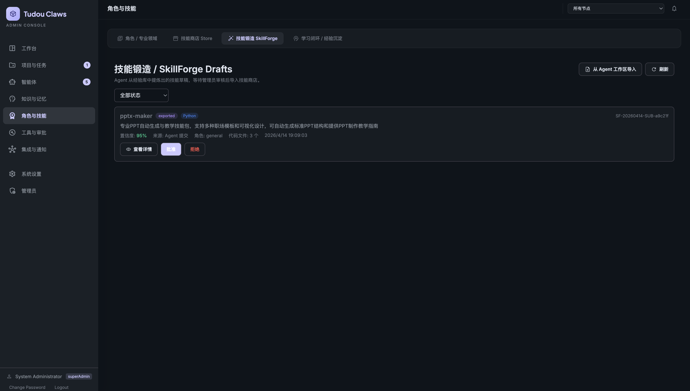
  <br/>
  <em>SkillForge — Agent 提交技能 → 管理员审核 → 自动入库</em>
</p>

### 💬 全渠道集成 — Channels

Agent 不只活在 Web 控制台——它们可以直接在你的 IM 平台上服务。

<p align="center">
  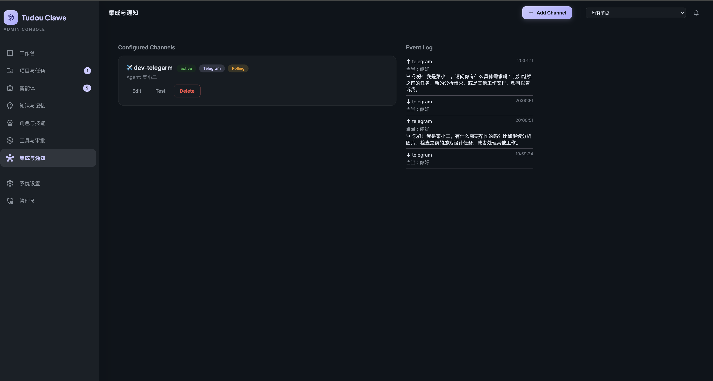
  <br/>
  <em>渠道管理 — 将 Agent 连接到各种 IM 平台</em>
</p>

| 平台 | 模式 | 说明 |
|------|------|------|
| Telegram | Polling / Webhook | 绑定 Bot Token，自动接收和回复消息 |
| Slack | Webhook | Bot 集成 |
| Discord | Webhook | Bot 集成 |
| 钉钉 (DingTalk) | Webhook | 自定义机器人 |
| 飞书 (Feishu) | Webhook | 自定义机器人 |
| 企业微信 (WeChat Work) | Webhook | 应用消息 |
| Webhook | Webhook | 通用 HTTP 回调 |

- **灵活绑定**：每个渠道绑定一个 Agent，消息自动路由
- **双向通信**：Inbound（收消息）+ Outbound（发消息）
- **事件日志**：所有渠道消息实时记录，可在 Portal 查看
- **内网友好**：Polling 模式无需公网 IP，适合内网部署

### 🔌 MCP 工具生态

基于 [Model Context Protocol](https://modelcontextprotocol.io/) 的标准化工具扩展体系。

<p align="center">
  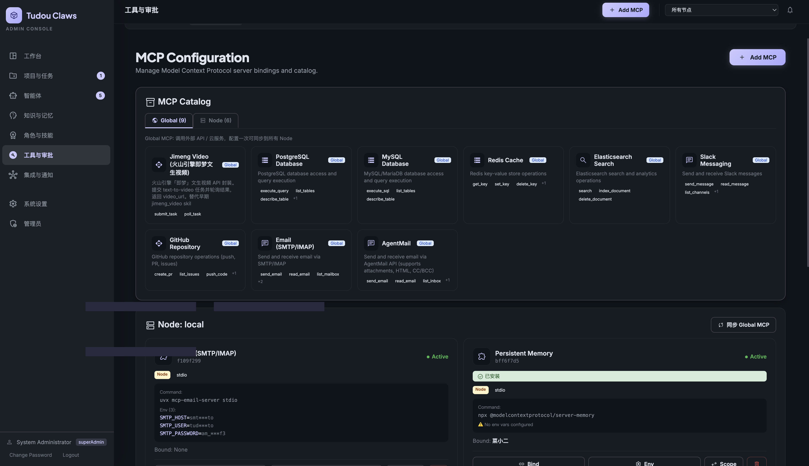
  <br/>
  <em>MCP 工具管理 — 灵活绑定工具到 Agent</em>
</p>

**内置 MCP 服务：**
- `filesystem` — 文件读写、搜索、目录管理
- `database` — 数据库查询与管理
- `agentmail` — AI 邮件发送与接收
- `chromadb` — 向量数据库检索
- `web_search` — 网络搜索
- `browser_automation` — **网页自动化**（详见下方）

**工具绑定机制：**
- 按 Agent 精确绑定：`"coder": ["filesystem", "database"]`
- 通配符绑定：`"*": ["agentmail"]`（所有 Agent 共享）
- 作用域区分：全局（云 API）vs 节点（本地安装）
- Portal 可视化管理绑定关系

### 🌐 网页自动化 — Browser Automation MCP

Agent 可以像人一样操作浏览器：打开网页、登录、填写表单、点击按钮、下载文件、提取页面内容。

**基于 Playwright 的内置 MCP 服务**，提供 8 个原子浏览器操作工具：

| 工具 | 功能 | 典型场景 |
|------|------|----------|
| `browser_navigate` | 打开 URL | 访问登录页面 |
| `browser_screenshot` | 页面截图（base64 PNG） | 观察页面状态、验证操作结果 |
| `browser_get_text` | 提取页面可见文本 | 分析页面结构、查找元素 |
| `browser_fill` | 填写输入框 | 输入用户名、密码、搜索关键词 |
| `browser_click` | 点击元素（选择器或文本匹配） | 提交表单、点击按钮 |
| `browser_download` | 下载文件并保存到本地 | 下载报表、导出数据 |
| `browser_evaluate` | 执行 JavaScript | 获取页面状态、处理动态内容 |
| `browser_close` | 关闭浏览器会话 | 释放资源 |

**智能错误恢复**：当页面操作失败时，Agent 自动调用 `knowledge_lookup` 在知识库中搜索解决方案并重试。

**典型使用流程**：
```
用户: "登录 OA 系统，下载本月考勤报表并总结"

Agent 执行:
  1. browser_navigate → 打开 OA 登录页
  2. browser_get_text → 分析页面元素
  3. browser_fill × 2 → 填写用户名和密码
  4. browser_click → 点击登录按钮
  5. browser_screenshot → 验证登录成功
  6. browser_navigate → 进入考勤页面
  7. browser_download → 下载报表文件
  8. read_file → 读取下载的文件
  9. LLM 分析 → 生成考勤总结
  10. browser_close → 关闭浏览器
```

### ⏰ 定时调度 — Scheduler

内置任务调度系统，让 Agent 按计划自动执行任务。

<p align="center">
  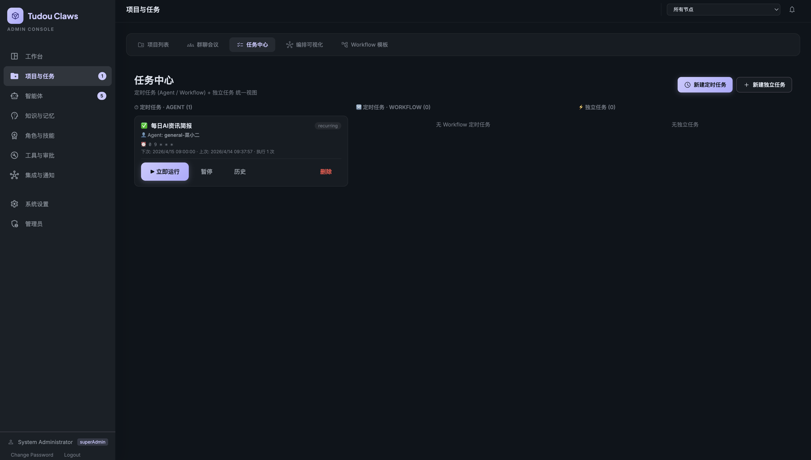
  <br/>
  <em>定时调度 — 配置 Agent 自动执行计划任务</em>
</p>

- **Cron 表达式**：灵活配置执行周期
- **模板任务**：预定义常用调度模板
- **渠道通知**：执行结果可推送到 Telegram / Slack 等渠道
- **Hub 感知**：自动关联 Hub 中的 Agent 和工具

### 🎭 Personas（人设角色）

为 Agent 配置不同的对外人设，同一个 Agent 可以在不同场景展示不同性格。

- 自定义名称、头像、开场白、语气风格
- 适用于客服场景：同一 Agent 可以在微信群是"小助手"，在 Telegram 是"Tech Support"

### 🌐 分布式 Hub/Node 架构

<p align="center">
  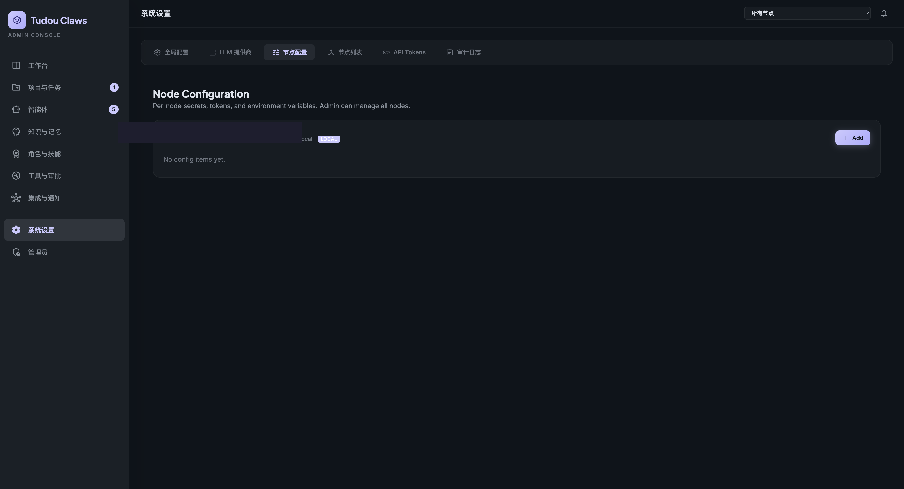
  <br/>
  <em>节点管理 — 分布式部署多个 Agent 工作节点</em>
</p>

- **Hub（中枢）**：运行 Portal 控制台，管理所有 Agent，调度任务
- **Node（节点）**：运行具体 Agent，连接到 Hub 注册
- **灵活拓扑**：单机运行 / 局域网多机 / 跨网络分布式
- **自动发现**：Node 启动后自动向 Hub 注册
- **配置同步**：Hub 配置变更自动推送到各 Node

### 💬 实时聊天与协作界面

<p align="center">
  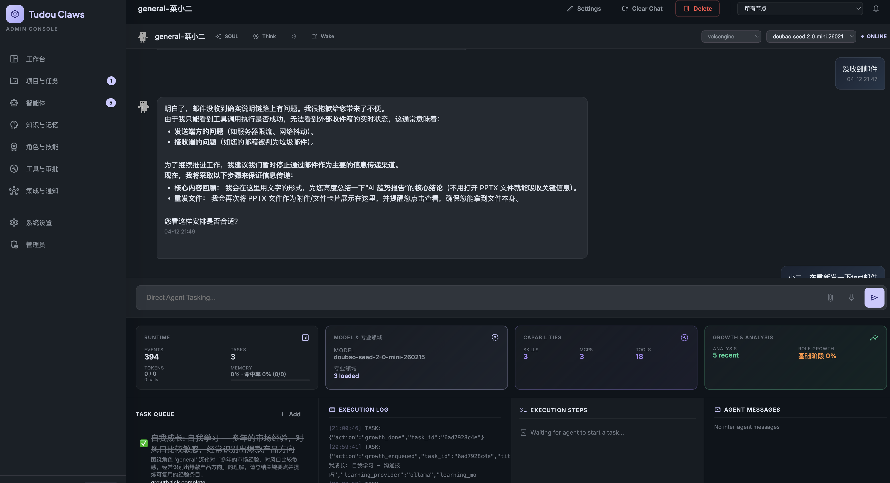
  <br/>
  <em>实时聊天界面 — 与 Agent 自然对话，实时看到工作进度</em>
</p>

- **流式响应**：SSE 实时推送，逐字显示 Agent 回复
- **Markdown 渲染**：支持代码高亮、表格、图片、链接
- **工具可视化**：实时展示 Agent 调用的工具和执行进度
- **交付件卡片**：自动识别和展示 Agent 产出的文件
- **文件附件**：支持上传附件，Agent 可读取和处理
- **语音输入/朗读**：支持语音输入和 TTS 朗读 Agent 回复

### 🔐 安全特性

参见下方「安全架构」章节，了解完整的安全体系。

### 🌍 国际化 (i18n)

- Portal 界面支持多语言切换
- 内置中文、英文支持
- 可扩展的翻译体系

---

## 架构概览

```
┌──────────────────────────────────────────────────────────────┐
│                     TudouClaw Portal (Web UI)                │
│  Dashboard │ Chat │ Projects │ Skills │ Workflows │ Channels │
└───────────────────────────┬──────────────────────────────────┘
                            │ HTTP / SSE
┌───────────────────────────▼──────────────────────────────────┐
│                      FastAPI Backend                          │
│  ┌──────────────┐  ┌──────────────┐  ┌────────────────────┐ │
│  │IntentResolver │  │WorkflowEngine│  │ Project Manager    │ │
│  │ 意图理解      │  │ 工作流引擎    │  │ 项目管理           │ │
│  └──────────────┘  └──────────────┘  └────────────────────┘ │
│  ┌──────────────┐  ┌──────────────┐  ┌────────────────────┐ │
│  │ SkillForge   │  │  SkillStore  │  │ Experience Library │ │
│  │ 技能锻造      │  │  技能商店     │  │ 经验库             │ │
│  └──────────────┘  └──────────────┘  └────────────────────┘ │
│  ┌──────────────┐  ┌──────────────┐  ┌────────────────────┐ │
│  │ MCP Manager  │  │  Scheduler   │  │ Channel Router     │ │
│  │ 工具管理      │  │  任务调度     │  │ 渠道路由           │ │
│  └──────────────┘  └──────────────┘  └────────────────────┘ │
│  ┌──────────────┐  ┌──────────────┐  ┌────────────────────┐ │
│  │ Knowledge    │  │  Auth/RBAC   │  │ Approval System    │ │
│  │ 知识库       │  │  认证/权限    │  │ 审批系统           │ │
│  └──────────────┘  └──────────────┘  └────────────────────┘ │
└──────┬───────────────────┬───────────────────┬───────────────┘
       │                   │                   │
┌──────▼──────┐  ┌─────────▼────────┐  ┌──────▼──────┐
│   Node A    │  │     Node B       │  │   Node C    │
│ ┌─────────┐ │  │ ┌──────┐┌──────┐ │  │ ┌─────────┐ │
│ │  Coder  │ │  │ │ CTO  ││Tester│ │  │ │Researcher│ │
│ │  Agent  │ │  │ │Agent ││Agent │ │  │ │  Agent   │ │
│ └────┬────┘ │  │ └──┬───┘└──┬───┘ │  │ └────┬────┘ │
│      │      │  │    │       │     │  │      │      │
│ ┌────▼────┐ │  │ ┌──▼───┐  │     │  │ ┌────▼────┐ │
│ │MCP Tools│ │  │ │Memory│  │     │  │ │MCP Tools│ │
│ │ 工具集  │ │  │ │ 记忆 │  │     │  │ │ 工具集  │ │
│ └─────────┘ │  │ └──────┘  │     │  │ └─────────┘ │
└─────────────┘  └───────────┘     │  └─────────────┘
                                   │
┌──────────────────────────────────┤
│       External Integrations      │
│  ┌──────────┐  ┌───────────────┐ │
│  │ Telegram │  │  Slack        │ │
│  │ Discord  │  │  DingTalk     │ │
│  │ Feishu   │  │  WeChat Work  │ │
│  └──────────┘  └───────────────┘ │
└──────────────────────────────────┘
                  │
       ┌──────────▼──────────┐
       │   LLM Providers     │
       │ OpenAI │ Anthropic  │
       │ Ollama │ vLLM       │
       │ LM Studio │ ...     │
       └─────────────────────┘
```

---

## 快速开始

### 环境要求

- Python 3.10+
- 至少一个 LLM API Key（OpenAI / Anthropic / 或兼容的本地模型）

### 安装

```bash
git clone https://github.com/pangalano1983-dev/TudouClaws.git
cd TudouClaws
pip install -r requirements.txt
```

### 启动 Portal（推荐）

```bash
python -m app portal --port 9090
```

首次启动会在终端打印管理员 Token 和 JWT Bearer Token，用于登录 Web 控制台和 API 调用。

```
  🥔 TudouClaw API (FastAPI)
  ─────────────────────────────────────
  Local:    http://localhost:9090
  Network:  http://192.168.x.x:9090
  API Docs: http://localhost:9090/api/docs

  ⚠  Admin Token (for login page):
  abc123...

  ⚠  JWT Bearer Token (for API calls):
  eyJhbG...
```

打开浏览器访问 `http://localhost:9090`，输入 Token 即可进入控制台。

<p align="center">
  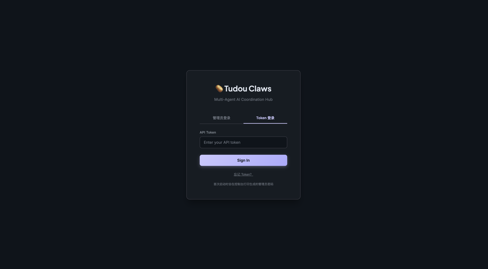
  <br/>
  <em>Token 登录界面</em>
</p>

### 其他启动方式

```bash
# 交互式命令行模式
python -m app repl

# 简单 Web 聊天模式
python -m app web --port 8080

# 作为 Node 连接到 Hub
python -m app node --hub http://hub-ip:9090 --secret <your-secret>
```

### 分布式部署

```bash
# 在主控机启动 Portal
bash deploy.sh portal

# 在工作机启动 Agent 节点
bash deploy.sh agent <portal-ip>
```

### 配置 LLM Provider

在 Portal 的「配置」页面中添加 LLM 供应商，或直接编辑配置文件：

```bash
# 支持的 Provider 类型：
# - openai_compatible: OpenAI / Ollama / vLLM / LM Studio / 任何 OpenAI 兼容 API
# - anthropic: Anthropic Claude API
```

<p align="center">
  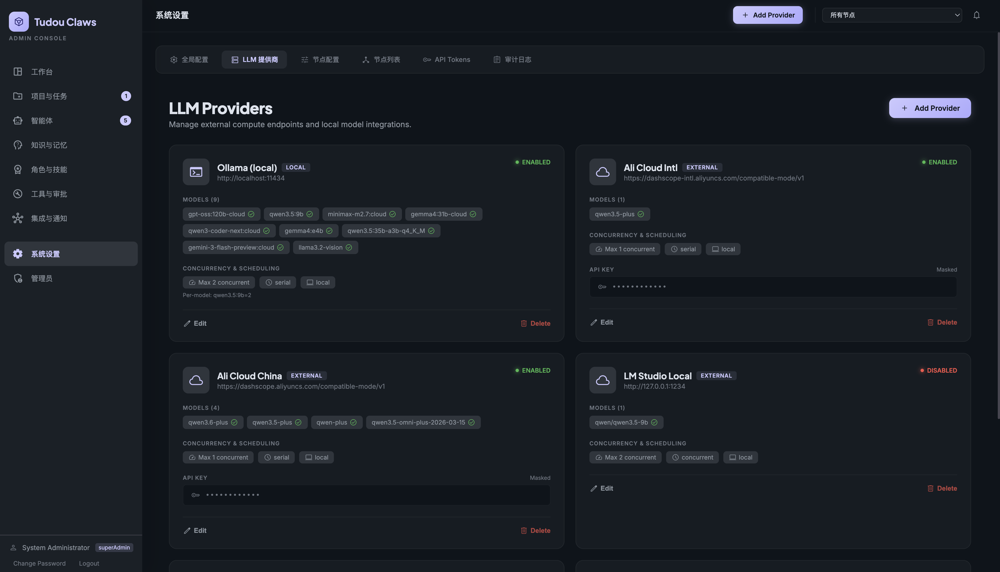
  <br/>
  <em>LLM Provider 配置界面</em>
</p>

### 连接 Telegram Bot（示例）

1. 在 Portal → Channels → Add Channel
2. 选择 Telegram 类型，输入 Bot Token（从 @BotFather 获取）
3. 选择 Polling 模式（内网无需公网 IP）
4. 绑定一个 Agent
5. 点击 Test 验证连接

---

## 项目结构

```
TudouClaw/
├── app/                          # 主应用目录
│   ├── __main__.py               # 入口文件（portal / repl / web / node）
│   ├── agent.py                  # Agent 核心实现
│   ├── agent_types.py            # 类型定义（枚举、数据类）
│   ├── agent_llm.py              # LLM 交互 Mixin
│   ├── agent_execution.py        # 工具执行 Mixin
│   ├── agent_growth.py           # 自成长 Mixin
│   ├── hub/                      # Hub 多 Agent 协调中枢
│   ├── llm.py                    # LLM Provider 统一接口
│   ├── tools.py                  # 20+ 内置工具注册与执行
│   ├── channel.py                # 渠道集成（Telegram/Slack/Discord/...）
│   ├── scheduler.py              # 定时任务调度器
│   ├── auth.py                   # JWT 认证与 RBAC
│   ├── api/                      # FastAPI 后端
│   │   ├── main.py               # 应用入口与 lifespan
│   │   ├── routers/              # 25 个 API 路由模块
│   │   ├── deps/                 # 依赖注入（Hub, Auth）
│   │   └── middleware/           # 安全中间件
│   ├── skills/                   # 技能系统
│   │   ├── engine.py             # 技能引擎（安装/卸载/执行）
│   │   ├── store.py              # 技能商店
│   │   ├── _skill_forge.py       # 技能锻造
│   │   └── _skill_scout.py       # 技能发现
│   ├── mcp/                      # MCP 工具生态
│   │   ├── manager.py            # MCP 服务管理
│   │   ├── router.py             # MCP 调用路由
│   │   └── builtins/             # 内置 MCP 服务
│   ├── core/                     # 核心领域模块
│   │   ├── intent_resolver.py    # 意图理解
│   │   ├── workflow.py           # 工作流引擎
│   │   ├── project.py            # 项目管理
│   │   ├── memory.py             # 三层记忆
│   │   ├── delegation.py         # 任务委派
│   │   └── approval.py           # 审批系统
│   ├── server/                   # Legacy Portal 服务（兼容层）
│   │   └── static/js/            # 前端 JS 模块
│   └── static/                   # 静态资源
│       ├── robots/               # 12 个角色机器人 SVG
│       ├── souls/                # 角色灵魂提示词 + 主动思考规则
│       └── config/               # 角色配置
├── src/                          # 上游 fork 代码（运行时引擎）
├── data/                         # 运行时数据
├── tests/                        # 测试套件
├── tools/                        # CLI 诊断工具
├── deploy.sh                     # Linux/Mac 部署脚本
├── deploy_windows.ps1            # Windows 部署脚本
└── requirements.txt              # Python 依赖
```

---

## 使用场景

### 软件开发团队模拟

创建一个由 CEO、Architect、Coder、Reviewer、Tester 组成的虚拟团队，使用「软件开发全流程」工作流模板：

```
需求分析 → 架构设计 → 编码实现 → 代码审查 → 测试验证 → 部署交付
```

每个步骤由对应角色的 Agent 执行，产出物自动流转到下一步。

### 客服与运营自动化

通过 Channels 将 Agent 连接到 Telegram/Slack/企业微信，自动回复客户咨询。结合 Knowledge Base 上传产品文档，Agent 基于知识库精准回答。

### 研究分析

让 Researcher Agent 进行技术调研，Data Agent 进行数据分析，PM Agent 整理成产品建议报告。

### 知识管理与技能积累

Agent 在执行任务过程中自动积累经验。随着经验增多，SkillForge 会自动发现重复模式并提炼为可复用的技能包，经管理员审核后进入 Skill Store 供所有 Agent 使用。

### 定时自动化

通过 Scheduler 配置 Agent 定期执行报告生成、数据巡检、系统监控等任务，执行结果自动推送到指定渠道。

---

## 技术栈

**后端核心：**
- Python 3.10+ — 主运行时
- FastAPI — Web 框架（替代原有 BaseHTTPRequestHandler）
- Uvicorn — ASGI 服务器
- Rust — CLI 工具和高性能组件

**LLM 集成：**
- OpenAI / Anthropic / Ollama / vLLM / LM Studio / 任何 OpenAI 兼容 API
- 支持 Provider 降级链：主 Provider 不可用时自动切换备用

**工具协议：**
- MCP (Model Context Protocol) — 标准化工具扩展
- JSON-RPC 2.0 over stdio — MCP 传输层

**前端：**
- 原生 HTML/CSS/JS SPA — 零框架依赖，开箱即用
- SSE (Server-Sent Events) — 实时流式响应
- Material Symbols — UI 图标

**存储：**
- JSON 文件持久化（零依赖，开箱即用）
- ChromaDB 向量数据库（可选，用于 RAG）
- MySQL / PostgreSQL（可选，生产环境推荐）

**认证：**
- JWT (JSON Web Tokens) — 无状态认证
- RBAC — 角色分级权限控制

---

## 路线图

- [x] 多角色 Agent 团队协作（12 角色 + Active Thinking）
- [x] DAG 工作流引擎 + 15 个预定义模板
- [x] 三层记忆架构 + 经验自成长
- [x] IntentResolver 意图理解
- [x] SkillForge 技能自锻造 + SkillStore 技能商店
- [x] SkillScout 技能在线发现
- [x] 分布式 Hub/Node 架构
- [x] MCP 工具生态
- [x] 项目管理全景看板
- [x] Portal Web 控制台（FastAPI 重构）
- [x] 全渠道集成（Telegram / Slack / Discord / 钉钉 / 飞书 / 企微）
- [x] 定时调度系统
- [x] Knowledge Base 知识库
- [x] JWT 认证 + RBAC 权限
- [x] Personas 人设管理
- [x] 国际化 (i18n)
- [x] 语音输入与朗读
- [ ] 插件市场
- [ ] Agent 间自主协商机制
- [ ] 可视化工作流编辑器
- [ ] 移动端适配
- [ ] Rust CLI 功能对齐

---

## 贡献指南

欢迎贡献！请参阅 [CONTRIBUTING.md](./CONTRIBUTING.md) 了解详细的贡献流程。

**贡献方向：**
- 新增工作流模板
- 开发 MCP 工具服务
- 编写和分享技能包
- 完善文档和测试
- Bug 修复和性能优化
- 前端 UI 改进
- 新增渠道适配器

---

## 安全架构

> **AI Agent 拥有工具调用能力，安全不是附加功能，而是核心架构。**
> TudouClaw 在每一层都内置了安全机制，确保 Agent 的行为可控、可审计、可回溯。

### 🛡️ 纵深防御体系

```
┌─────────────────────────────────────────────────────────────┐
│ Layer 1: 认证与访问控制                                       │
│  JWT Token 认证 · RBAC 三级权限 · MCP 绑定授权                │
├─────────────────────────────────────────────────────────────┤
│ Layer 2: 传输安全                                            │
│  HTTPS 强制 · HSTS · HttpOnly Cookie · SameSite · Secure    │
├─────────────────────────────────────────────────────────────┤
│ Layer 3: Agent 行为控制                                      │
│  工具白名单/黑名单 · 审批门控 · 风险等级分类 · 沙箱隔离         │
├─────────────────────────────────────────────────────────────┤
│ Layer 4: 代码安全                                            │
│  AST 静态分析 · 危险 import 拦截 · 运行时上下文注入 · 凭据检测  │
├─────────────────────────────────────────────────────────────┤
│ Layer 5: 网络安全                                            │
│  MCP 网络隔离 · HTTP Host 白名单 · 凭据不落盘 · 审计日志       │
└─────────────────────────────────────────────────────────────┘
```

### Layer 1: 认证与访问控制

| 机制 | 说明 |
|------|------|
| **JWT 认证** | 所有 API 请求携带 Bearer Token，无状态验证，可配置过期时间 |
| **RBAC 三级权限** | `superAdmin`（全权）→ `admin`（管理）→ `user`（使用），不同角色可访问的 API 不同 |
| **MCP 绑定授权** | Agent 只能调用管理员显式绑定的 MCP 工具。未绑定 = 无权限，从架构层面阻断越权访问 |
| **Session 管理** | 服务端 HttpOnly Cookie + JWT 双重认证，前端无法读取 Cookie |

### Layer 2: 传输安全

| 机制 | 说明 |
|------|------|
| **HTTPS 强制** | 可配置 HTTPS 重定向，生产环境建议强制开启 |
| **HSTS** | HTTP Strict Transport Security，防止协议降级攻击 |
| **安全 Cookie** | `HttpOnly`（防 XSS 窃取）+ `SameSite=Lax`（防 CSRF）+ `Secure`（仅 HTTPS 传输） |
| **安全响应头** | `X-Content-Type-Options: nosniff` · `X-Frame-Options: DENY` · `X-XSS-Protection: 1` |
| **SQL 注入防护** | 数据库层 ORDER BY 白名单验证，参数化查询 |

### Layer 3: Agent 行为控制

| 机制 | 说明 |
|------|------|
| **工具白名单/黑名单** | 每个 Agent 独立配置 `allowed_tools` 和 `denied_tools`，精确控制可用能力 |
| **审批门控** | 高风险操作（文件删除、系统命令、外部通信）需人工确认后才能执行 |
| **风险等级分类** | 每个工具标记风险等级（safe / moderate / dangerous），不同等级触发不同审批策略 |
| **执行策略** | `standard`（需审批）/ `full`（自动执行）/ `restricted`（严格限制），按 Agent 独立配置 |
| **沙箱隔离** | Agent 工作目录隔离（jail root），跨 Agent 访问需显式授权 |

### Layer 4: 代码安全（技能沙箱）

Agent 提交的技能代码在严格的沙箱中运行：

**静态分析（编译前拦截）：**
- AST 语法树扫描，拦截危险模式
- **禁止 import**：`subprocess`、`socket`、`requests`、`ctypes`、`pickle`、`shutil`、`sqlite3` 等 30+ 模块
- **禁止内置函数**：`exec()`、`eval()`、`compile()`、`__import__()`、`open()`
- **禁止 OS 操作**：`os.system()`、`os.popen()`、`os.environ` 访问
- **凭据检测**：扫描代码中的硬编码 API Key、密码、Token

**运行时隔离（执行中限制）：**
- IO 操作通过 `SkillContext` 代理，不直接访问系统资源
- MCP 调用受 `manifest.depends_on_mcp` 声明约束
- HTTP 请求受 `manifest.allowed_http_hosts` 白名单约束
- 环境变量受 `manifest.allowed_env_keys` 白名单约束

### Layer 5: 网络安全

**这是多 Agent 系统特有的安全挑战——Agent 拥有网络访问能力时，必须确保不会被利用为攻击跳板。**

| 威胁 | 防护措施 |
|------|----------|
| **凭据泄露** | 用户凭据仅在 Agent 对话上下文中传递，不写入日志、不落盘持久化。MCP 环境变量通过 `env_overrides` 注入，不暴露给其他 Agent |
| **SSRF 攻击** | 技能 HTTP 请求受 `allowed_http_hosts` 白名单约束；Browser Automation MCP 仅管理员绑定后可用 |
| **数据外泄** | Agent 工作目录隔离，跨 Agent 文件访问需 `authorized_workspaces` 授权。外发邮件/消息需审批门控 |
| **注入攻击** | LLM Prompt Injection 通过意图分类（IntentResolver）+ 系统提示词隔离缓解；用户输入不直接拼接到工具参数 |
| **浏览器安全** | Browser Automation MCP 默认 headless 模式运行；浏览器进程随 MCP 会话结束自动销毁；Cookie/Session 不跨会话保留 |
| **横向移动** | 每个 Agent 独立的工具绑定和权限配置；即使一个 Agent 被攻陷，无法访问其他 Agent 的工具和数据 |
| **审计追溯** | 所有工具调用记录在审计日志中（调用者、工具名、参数、结果、时间戳），支持事后追溯 |

### Browser Automation 安全最佳实践

Browser Automation MCP 赋予 Agent 操作真实浏览器的能力，安全使用建议：

```
✅ 推荐做法                          ❌ 避免做法
─────────────────────────           ─────────────────────────
仅绑定给信任的 Agent                  不要绑定给所有 Agent
凭据通过环境变量注入                   不要在知识库中明文存储密码
生产环境启用 headless 模式             不要在公网服务器开启 headed 模式
操作完毕主动 browser_close             不要长时间保持浏览器会话
知识库存储操作步骤而非凭据              不要在审计日志中记录密码明文
限制 browser_evaluate 的使用          不要执行不受信任的 JavaScript
```

---

## License

[Apache License 2.0](./LICENSE)

---

<p align="center">
  <strong>TudouClaw — 让每个人都拥有自己的 AI 团队 🥔🐾</strong>
</p>

<p align="center">
  如果觉得有帮助，请给项目一个 ⭐ Star
</p>
